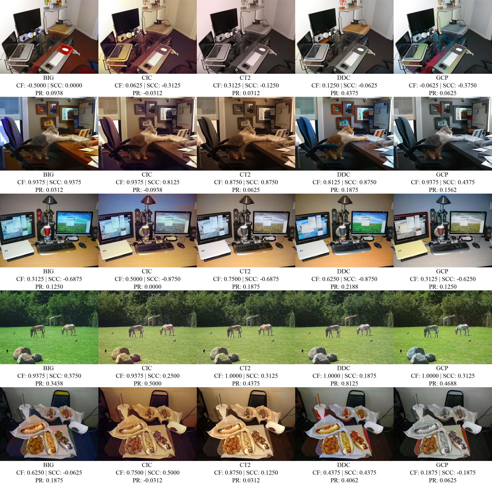
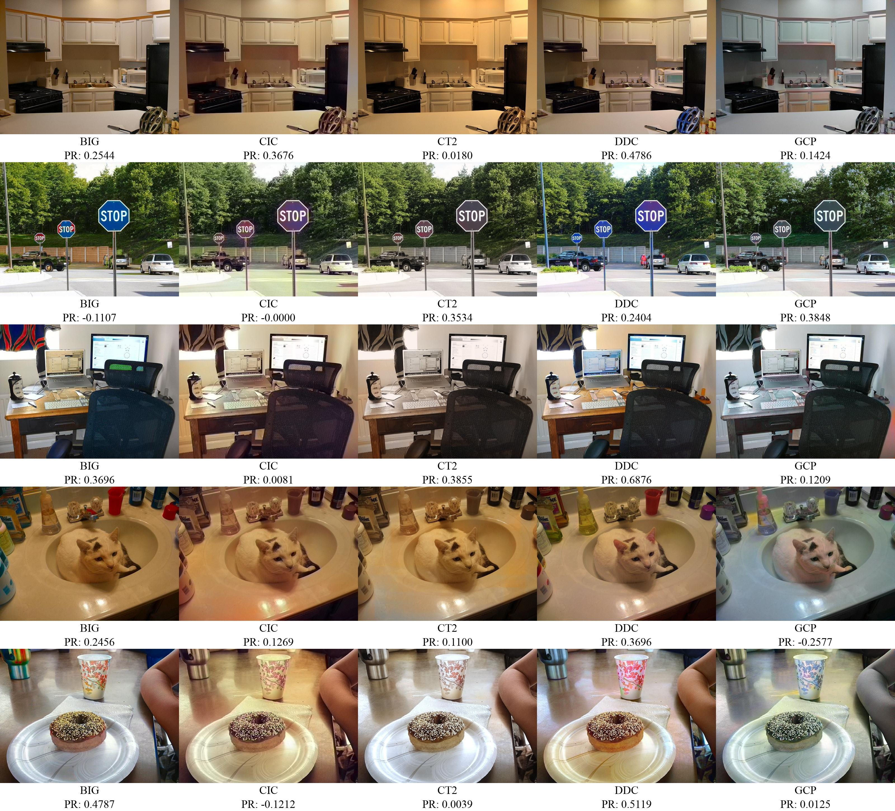

## ICQA-2K: Multi-Dimensional No-Reference Quality Assessment for Image Colorization

Automatic image colorization has achieved significant advancements, yet evaluating the quality of colorized images remains an ongoing challenge. Current research lacks dedicated datasets and evaluation models designed specifically for the unique artifacts and semantic demands of colorization. Conventional metrics fail to adequately address the ill-posed nature of the task, while existing no-reference quality measures often lack semantic awareness. To address this gap, we introduce ICQA-2K, a multi-dimensional benchmark along with a novel no-reference assessment framework. The ICQA-2K dataset comprises 2,000 samples synthesized via five representative colorizers, each annotated with Mean Opinion Scores across three dimensions: Chromatic Fidelity (CF), Semantic Color Consistency (SCC), and Perceptual Realism (PR). Building on this, we propose ICQA‑Net, a network that integrates chromatic analysis, semantic validation using category-specific color priors, and a global realism encoder. Experimental results show that ICQA‑Net achieves a SOTA SRCC of 0.9210, significantly outperforming existing metrics. 

### Quick Start
Dateset and pretrained weights have been published at https://drive.google.com/drive/folders/17_hsCGqJaCEHZOoI4_4DGI8Mz7xlYXmj?usp=drive_link.

Download all folders and files in the dataset&pretrain folder and put them into the ICQA folder, otherwise you need to modify the path in the training and testing files.

Using CF.pth, SCC.pth and PR.pth, you can run infer_CF.py and infer_SCC.py directly. 

Then, using the files updated or generated by these two files, you can run infer_PR.py to get the final PR scores.

### Training
Running train_CF.py and train_SCC.py with proper learning rate can generate CF.pth and SCC.pth.

Then you need to use infer_CF.py and infer_SCC.py to infer the CF and SCC scores.

Training train_PR.py needs CF and SCC prediction scores.

After getting the PR.pth, use infer_PR.py to infer the final PR scores.

### Sample
25 samples of ICQA-2K dataset. Each image has tri-dimensional scores.

25 samples of the results of ICQA-Net.

